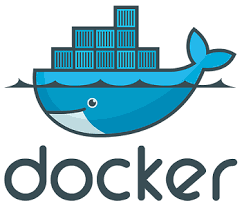
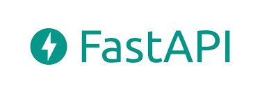
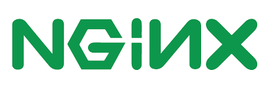

# Student Platform for Test Posting and Grading

The Student Platform is a web application designed to streamline the process of posting tests and exams for students and enabling teachers to efficiently manage and grade those tests. Leveraging the powerful combination of FastAPI, PostgreSQL, and NGINX, this platform offers a robust and scalable solution for educational institutions to effectively conduct assessments and monitor student progress.

## Key Features

* **Test Posting and Access:** Teachers can easily create and post tests, exams, and assignments on the platform. Students have access to view the available tests and their respective details, such as deadlines and instructions.
* **Test Submission:** Students can submit their completed tests and assignments online through a secure submission system. The platform ensures that submissions are timestamped and tracked, providing transparency and accountability.
* **Teacher Control and Grading:** Teachers can access and review submitted tests, evaluate them, and provide marks and feedback to students. The grading process is efficient, reducing manual paperwork and ensuring timely feedback to students.
* **Test Results and Analytics:** Students can view their test results and feedback on the platform. Teachers and administrators have access to detailed analytics and reports on student performance and test outcomes.
* **User Authentication and Security:** The platform employs a secure user authentication system to safeguard student and teacher data. Role-based access control ensures that only authorized users can access and perform specific actions.
* **Scalability and Performance:** The stack consisting of FastAPI, PostgreSQL, and NGINX offers high performance and scalability to handle a large number of users and data.
* **Intuitive User Interface:** The platform boasts an intuitive and user-friendly interface, making it easy for both students and teachers to navigate and use.

## How to Use

1. Clone this repository to your local machine.
2. Install the required dependencies by running `pip install -r requirements.txt`.
3. Configure your PostgreSQL database settings in `conf.py`.
4. Run the application using `uvicorn main:app --host 0.0.0.0 --port 8000`.
5. Access the Student Platform in your web browser at `http://localhost:8000`.

## Contributing

We welcome contributions to improve and extend the functionality of the Student Platform. Please feel free to open issues for bug reports, feature requests, or any other suggestions.

## Stack

## License

The Student Platform is open-source and released under the [MIT License](https://chat.openai.com/c/LICENSE). Feel free to use and modify it for your educational needs.

With the Student Platform, educational institutions can modernize their assessment processes, providing a digital environment for students and teachers to interact and collaborate. By automating test posting, submission, grading, and result delivery, the platform empowers educators to focus more on teaching and supporting students, resulting in an enhanced learning experience for all.

By combining the strengths of FastAPI, PostgreSQL, and NGINX, the platform ensures optimal performance, data security, and seamless communication between users. Whether it's a school, college, or university, the Student Platform is a versatile solution that helps educational institutions adapt to the evolving digital landscape and elevate their educational offerings.
